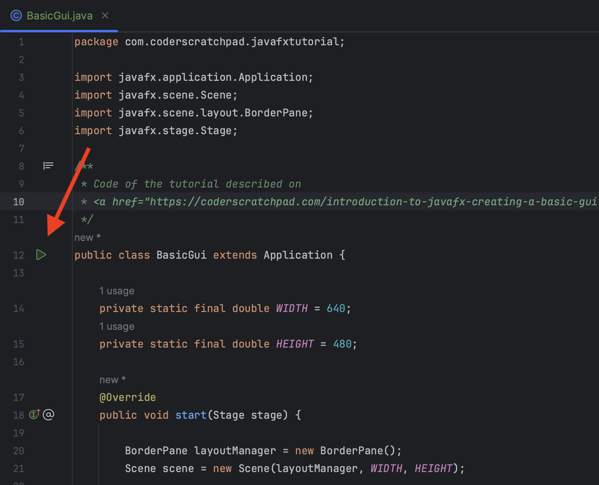

# JavaFX Tutorials

This project contains the sources of the various JavaFX tutorials that are published
on [coderscratchpad.com](https://coderscratchpad.com).

## Prerequisites

* Java 21
* IDE, e.g. IntelliJ IDEA, with this project to easily run each example application

## Executing the Examples

Each code-file contains a link to the tutorial, and can be executed on itself by hitting the run button in your IDE:

